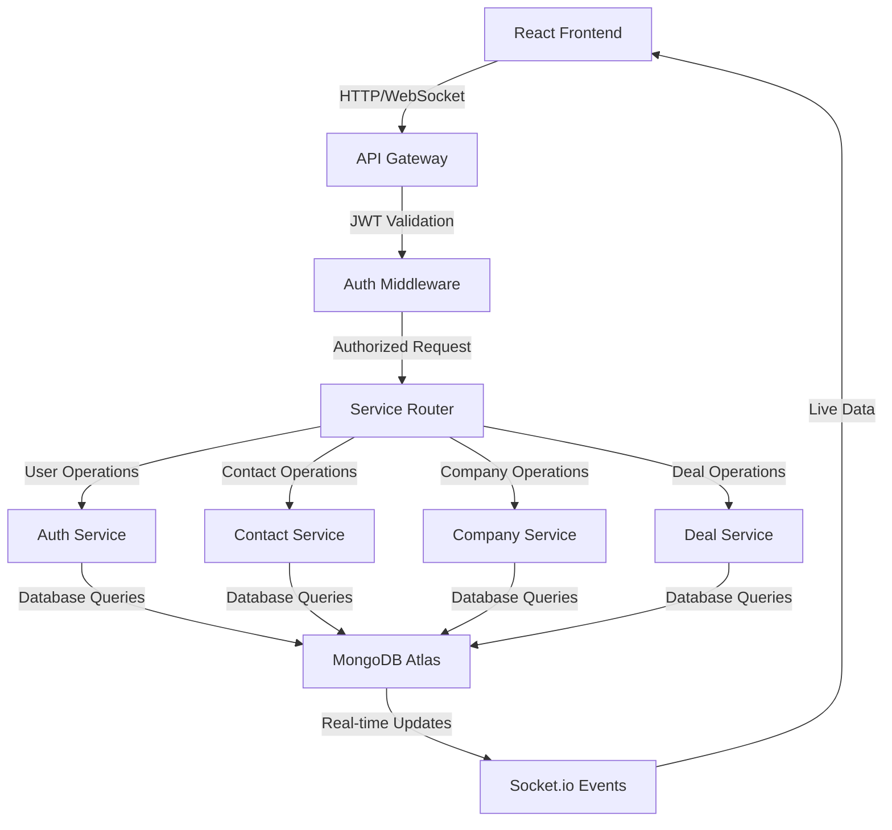
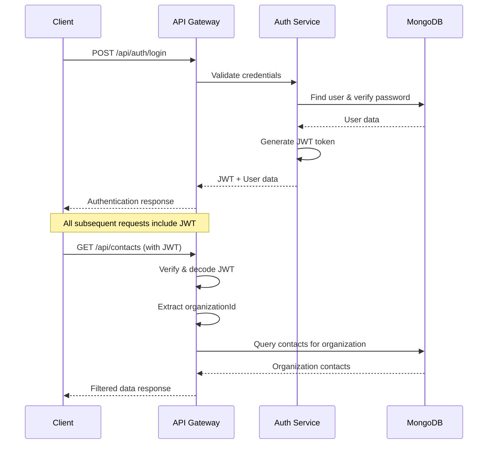

# 🏗️ Architecture Deep Dive

## System Architecture Overview

Our CRM SaaS platform is built on a modern microservices architecture that prioritizes scalability, maintainability, and security. Each service is designed to be independently deployable and scalable.

## 🎯 Design Principles

### 1. Multi-Tenancy First

- **Organization-based isolation**: Every data operation is scoped to an organization
- **Secure tenant separation**: Zero data leakage between organizations
- **Scalable tenant onboarding**: Automatic organization setup during registration

### 2. Type Safety Everywhere

- **End-to-end TypeScript**: From database to UI components
- **Zod schema validation**: Runtime type checking and validation
- **tRPC integration**: Type-safe API contracts

### 3. Performance Optimized

- **Database indexing**: Strategic MongoDB indexes for optimal query performance
- **Caching layers**: Redis for session and data caching
- **Connection pooling**: Efficient database connection management

## 📊 Data Flow Architecture



## 🔐 Security Architecture

### Authentication Flow



### Data Isolation Strategy

Every database operation includes organization-based filtering:

```javascript
// Example: Contact retrieval with organization isolation
const contacts = await db.collection("contacts").find({
  organizationId: user.organizationId, // ✅ Tenant isolation
  // ... other filters
});
```

## 📚 Database Design

### Collections Schema

#### Users Collection

```javascript
{
  _id: ObjectId,
  firstName: String,
  lastName: String,
  email: String (unique),
  password: String (bcrypt hashed),
  organizationId: ObjectId, // 🔑 Tenant key
  role: "admin" | "manager" | "sales_rep" | "viewer",
  isActive: Boolean,
  preferences: Object,
  createdAt: Date,
  updatedAt: Date,
  lastLoginAt: Date
}
```

#### Organizations Collection

```javascript
{
  _id: ObjectId,
  name: String,
  slug: String (unique),
  plan: "starter" | "professional" | "enterprise",
  status: "active" | "suspended" | "cancelled",
  settings: {
    currency: String,
    timezone: String,
    dateFormat: String,
    features: Array
  },
  billing: {
    currentPeriodStart: Date,
    currentPeriodEnd: Date
  },
  createdAt: Date,
  updatedAt: Date
}
```

#### Contacts Collection

```javascript
{
  _id: ObjectId,
  organizationId: ObjectId, // 🔑 Tenant key
  firstName: String,
  lastName: String,
  email: String,
  phone: String,
  companyId: ObjectId,
  jobTitle: String,
  status: "active" | "inactive" | "prospect",
  tags: Array,
  lastContact: Date,
  createdAt: Date,
  updatedAt: Date
}
```

### Indexing Strategy

```javascript
// Performance-optimized indexes
db.contacts.createIndex({ organizationId: 1, email: 1 });
db.contacts.createIndex({ organizationId: 1, companyId: 1 });
db.contacts.createIndex({ organizationId: 1, status: 1 });
db.contacts.createIndex({ organizationId: 1, createdAt: -1 });

db.companies.createIndex({ organizationId: 1, name: 1 });
db.companies.createIndex({ organizationId: 1, industry: 1 });
```

## 🔄 Real-Time Architecture

### WebSocket Implementation

```javascript
// Server-side Socket.io setup
io.use(authenticateSocket);

io.on("connection", (socket) => {
  const { organizationId } = socket.user;

  // Join organization room for targeted updates
  socket.join(`org-${organizationId}`);

  // Handle organization-scoped events
  socket.on("contact:create", (data) => {
    // Broadcast to organization members only
    io.to(`org-${organizationId}`).emit("contact:created", data);
  });
});
```

## 🚀 Performance Optimizations

### Frontend Optimizations

1. **Code Splitting**: Route-based and component-based splitting
2. **Lazy Loading**: Dynamic imports for heavy components
3. **Memoization**: React.memo and useMemo for expensive operations
4. **Virtualization**: Virtual scrolling for large lists
5. **Prefetching**: Strategic data prefetching with React Query

### Backend Optimizations

1. **Database Aggregation**: MongoDB pipelines for complex queries
2. **Connection Pooling**: Efficient database connections
3. **Response Compression**: Gzip/Brotli for reduced payload size
4. **Caching**: Redis for frequently accessed data
5. **Query Optimization**: Selective field projection

### Example: Optimized Company Aggregation

```javascript
// Efficient company query with contact count
const companiesWithCounts = await db.collection("companies").aggregate([
  { $match: { organizationId: orgId } },
  {
    $lookup: {
      from: "contacts",
      let: { companyId: "$_id" },
      pipeline: [
        { $match: { $expr: { $eq: ["$companyId", "$$companyId"] } } },
        { $count: "count" },
      ],
      as: "contactCounts",
    },
  },
  {
    $addFields: {
      contactCount: { $arrayElemAt: ["$contactCounts.count", 0] },
    },
  },
  { $project: { contactCounts: 0 } },
]);
```

## 🧪 Testing Architecture

### Testing Pyramid

1. **Unit Tests (60%)**: Component and service logic testing
2. **Integration Tests (30%)**: API endpoint and database testing
3. **E2E Tests (10%)**: Critical user journey validation

### Test Data Strategy

```javascript
// Automated test data seeding
const seedTestData = async (organizationId) => {
  const companies = await seedCompanies(organizationId);
  const contacts = await seedContacts(organizationId, companies);
  const deals = await seedDeals(organizationId, contacts, companies);

  return { companies, contacts, deals };
};
```

## 🔧 Development Workflow

### Git Strategy

- **Main Branch**: Production-ready code
- **Develop Branch**: Integration branch for features
- **Feature Branches**: Individual feature development
- **Hotfix Branches**: Critical production fixes

### CI/CD Pipeline

```yaml
# .github/workflows/ci.yml
name: CI/CD Pipeline
on: [push, pull_request]

jobs:
  test:
    runs-on: ubuntu-latest
    steps:
      - uses: actions/checkout@v3
      - name: Setup Node.js
        uses: actions/setup-node@v3
        with:
          node-version: "18"
      - name: Install dependencies
        run: npm ci
      - name: Run tests
        run: npm run test:ci
      - name: Build application
        run: npm run build
```

## 📊 Monitoring & Observability

### Application Metrics

- **Response Time**: API endpoint performance tracking
- **Error Rates**: 4xx/5xx error monitoring
- **Throughput**: Requests per second tracking
- **Database Performance**: Query execution time monitoring

### Business Metrics

- **User Engagement**: Feature usage analytics
- **Conversion Rates**: Trial to paid conversion tracking
- **Churn Analysis**: User retention metrics
- **Revenue Tracking**: Subscription and usage metrics

This architecture ensures our CRM platform is scalable, secure, and maintainable while delivering exceptional performance and user experience.
